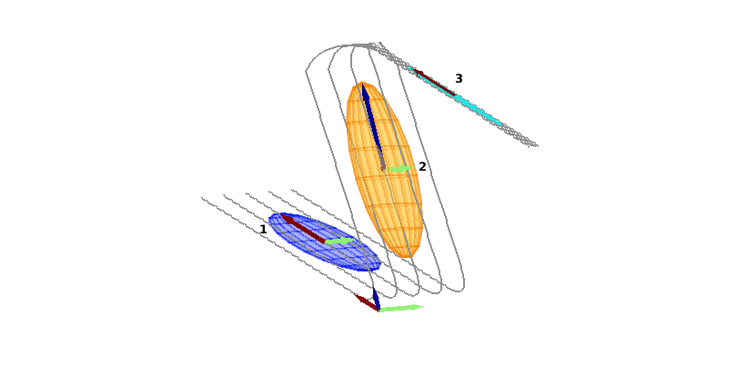

## Semi-Tied Gaussian Mixture Models/Hidden Semi-Markov Models

This package contains the algorithms, experiments and datasets for semi-tied GMMs/HMMs/HSMMs, included in   
```
Tanwani, A. K., Calinon, S., "Learning Robot Manipulation Tasks with Task-Parameterized Semi-Tied    
Hidden Semi-Markov Model", IEEE Robotics and Automation Letters (RA-L), vol. 1 (1), pp. 235-242, 2016.  
```

Semi-tied GMMs/HMMs/HSMMs decompose the covariance matrix into two terms: a common latent feature matrix of non-orthogonal basis vectors shared across all the mixture components; and a component-specific diagonal matrix that scales the appropriate subspace of each mixture component as convex combination of the basis vectors. In the figure below, the basis vector in red is shared across the first and the third mixture component, while the basis vector in green is shared across the first and the second mixture component. The basis vector in blue is tied only to the second mixture component.  


## Algorithms  
  
EM_STGMM.m - semi-tied Gaussian mixture model (GMM)  
EM_tensorSTGMM.m - task-parameterized semi-tied Gaussian mixture model  
EM_tensorSTHMM.m - task-parameterized semi-tied hidden Markov model  
EM_tensorSTHSMM.m - task-parameterized semi-tied hidden semi-Markov model  
TV_LQR_continuous_ff.m - time varying finite horizon linear quadratic tracking controller with feedforward term  
HSMM_LQR_controller.m - sampling the sequence of states from a hidden semi-Markov model and following the desired step-wise reference trajectory with a linear quadratic tracking controller  
  
## Examples  

Main_ST_GMM_Zshape3D.m  
Main_ST_GMM_ChickenDance.m  
Main_TP_ST_HSMM_BaxterPickPlace.m  
Main_TP_ST_HSMM_BaxterValve.m  

## Datasets  

ChickenDance.mat - Chicken Dance Movement: The dataset is taken from http://mocap.cs.cmu.edu/  
Zshape3D.mat - Zshape3D : Synthetic 3-dimensional z-shaped movement  
BaxterPickPlace.mat - Pick and Place Task: Demonstrations collected to teach Baxter manipulation task of picking an object from different initial configurations and placing it on the target by avoiding an obstace of varying height  
BaxterValveDemos2.mat - Valve Opening Task: Demonstrations collected to teach Baxter manipulation task of opening a valve from different initial configurations  
